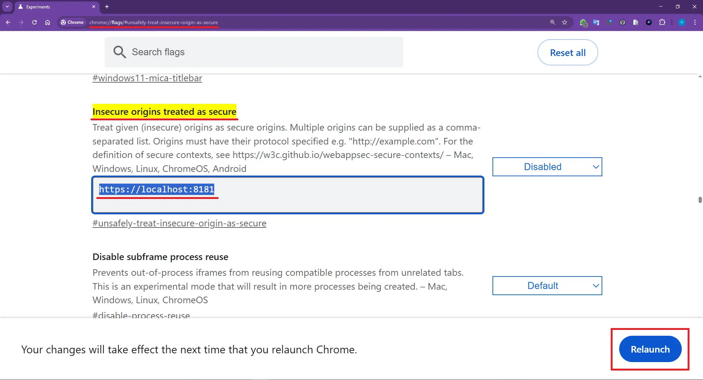
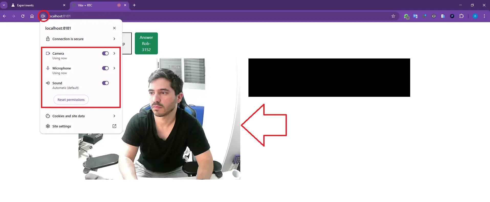

# WebRTC PeerConnection Signaling Suite

A robust TypeScript signaling solution for WebRTC applications using Socket.io as the signaling mechanism. The package provides an extensible and simple API for both server-side (signaling server) and client-side (browser/app) logic, enabling fast development of peer-to-peer video, audio, or data channels.

***

## Features

- **Written in TypeScript** for type safety and clarity.
- **Signaling server** fully decoupled from client logic.
- **Client helper class** for easy WebRTC peer connections and ICE negotiation.
- **Customizable event mapping**, STUN server configuration, and media constraints.
- **Extensible** for custom events or authentication flows.

***

## Requirements

- **Node.js** (>= 14)
- **socket.io** - for the signaling server side
- **socket.io-client** - for the client app side
- **TypeScript** (if using or building from source)

Install dependencies:

for server side
```shell
  npm install stream-rtc socket.io
```

for client side
```shell
  npm install stream-rtc socket.io-client
```


***

## Getting Started

### 1. Server Example (Signaling Server)

```typescript
import { Server } from 'socket.io';
import { RTCPeerConnectionServer } from 'stream-rtc';

const io = new Server(3000);

io.on('connection', (socket) => {
  const userId = socket.handshake.auth.userName || socket.id;
  new RTCPeerConnectionServer(socket, userId);
});
```

- Instantiate `RTCPeerConnectionServer` for each new socket.
- Handles offers, answers, and ICE candidate relay automatically.

***

### 2. Client Example of user to user

```typescript
import { io } from 'socket.io-client';
import { RTCPeerConnectionClient } from 'stream-rtc';

const socket = io('http://localhost:3000');
const rtcClient = new RTCPeerConnectionClient(socket, { userId: 'user-A' });

rtcClient.onOffersReceived((offers)=>{
    const offerOptions = offers;
    offerOptions.forEach(o => {
        o.onClick = () => {
            rtcClient.answerOffer().then(([localStream, remoteStream]) => {
                // Attach localStream and remoteStream to <video> HTML elements as needed, or include them in constructur props
            });
        }
    })
    // render offerOptions options
});


rtcClient.call().then(([localStream, remoteStream]) => {
  // Attach localStream and remoteStream to <video> HTML elements as needed, or include them in constructur props
});
```

### 2. Client Example room chat

```typescript
import { io } from 'socket.io-client';
import { RTCRoomConnectionClient, type RoomInfo } from 'stream-rtc';

const socket = io('http://localhost:3000');
const rtcClient = new RTCRoomConnectionClient(socket, { userId: getUserName(), localVideoElement }, { debugMode: true });

// first user should create room like that 
...
await pc.createRoom(roomName, {
    maxParticipants: 10,
    isPrivate: false,
    constraints: { video: true, audio: true },
});
...

// #################################################

// the rest users should join the room like that:
...
await pc.joinRoom(roomId, { video: true, audio: true });
...

```

- Use `call()` to request media permissions and initiate a connection.
- Listen and respond to offers with `answerOffer()`.
- ICE candidate and SDP negotiation is handled for you.

***

## Advanced Usage

- **Custom video/audio constraints:**
  Pass custom constraints to `call()` or `answerOffer()`.
- **Custom ICE servers:**
  Modify `PEER_CONFIGURATION` in `consts.ts` for different STUN/TURN servers.
- **Debugging:**
  Pass `{ debugMode: true }` to the client constructor to enable logging.


***

how to allow Chrome use camera/min on untrast https localhost certificate

1. go chrome flags [click here](chrome://flags/#unsafely-treat-insecure-origin-as-secure)

 
2. add your specific url like: https://localhost:8181
3. then refresh button will appear click it 
4. done! go to your chrome host and use camera! 



***

## Contributing

- Pull requests and issues are welcome!
- Please open issues for bugs, suggestions, or feature requests.

***

## License

MIT

***

Ready to build fast and robust WebRTC apps? Get started now!
For more information, see the code example of demo directory in the repository
